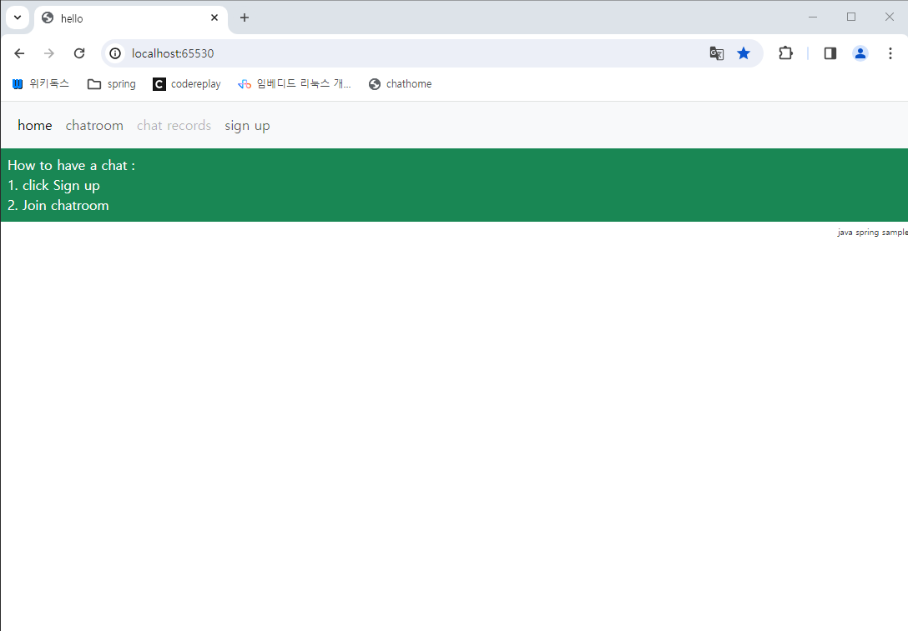
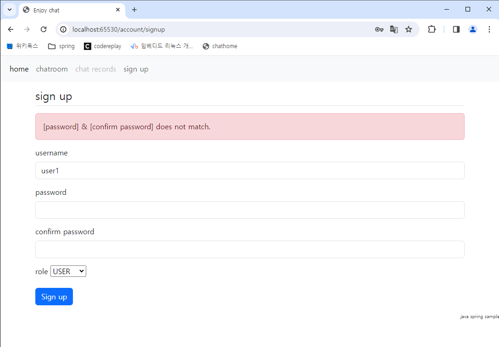
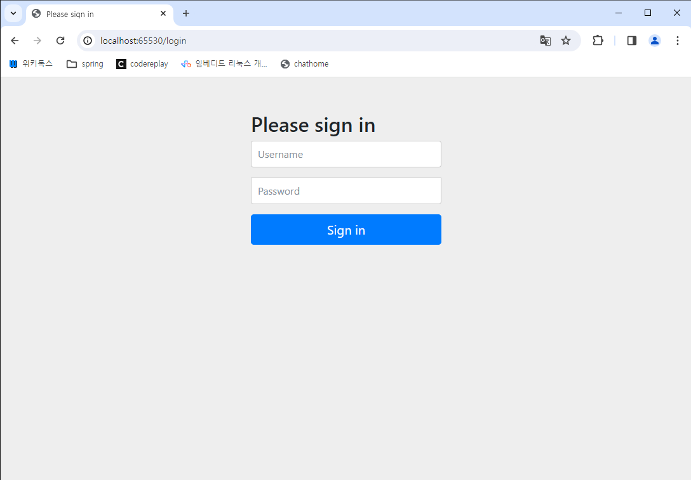
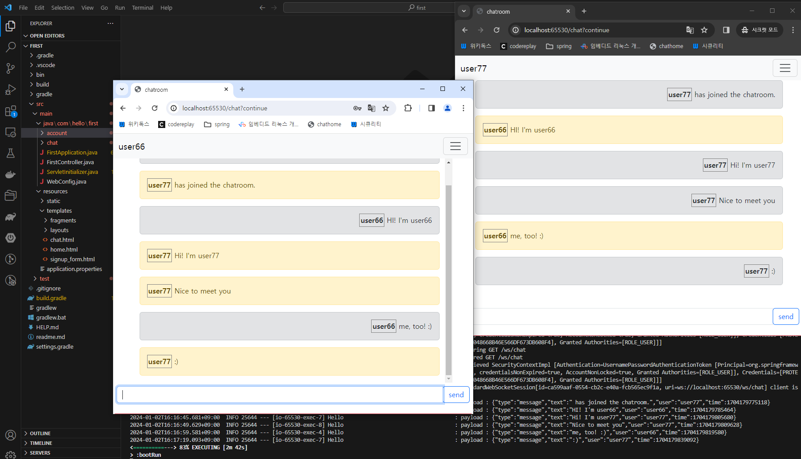

# Chatting Sample : working-on
- Sign up/in
- Chatting

## Prerequsite
- OpenJDK 21
- Spring Boot 3 + Spring Security 6
    - bootstrap 5.3.1
    - jquery 3.7.1
    - and so on.
- gradle 8.4
- mariadb 11.2.1
- VSCode + Java extensions

## Directory 
```
TBC
```
## Dependencies

### MariaDB
```
> mariadb -u root -p
Welcome to the MariaDB monitor.

MariaDB [(none)]> use chat_db
Database changed

MariaDB [(none)]> CREATE TABLE `accounts_tbl` (
`id` INT NOT NULL AUTO_INCREMENT,
`username` VARCHAR(20) CHARACTER SET utf8 COLLATE utf8mb4_general_ci NOT NULL,
`password` VARCHAR(73) CHARACTER SET utf8 COLLATE utf8mb4_general_ci NOT NULL,
`role` VARCHAR(10) CHARACTER SET utf8 COLLATE utf8mb4_general_ci NOT NULL,
PRIMARY KEY (`id`)
);
Query OK, 0 rows affected

MariaDB [chat_db]> ALTER TABLE `accounts_tbl` ADD UNIQUE (username);
MariaDB [chat_db]> ALTER TABLE `accounts_tbl`
	CHANGE COLUMN `role` `role` VARCHAR(10) NOT NULL DEFAULT 'USER' COMMENT 'ADMIN, USER' COLLATE 'utf8mb4_general_ci' AFTER `password`;

MariaDB [chat_db]> select * from accounts_tbl;
+----+----------+------------+------+
| id | username | password   | role |
+----+----------+------------+------+
```

### [thymeleaf](https://mvnrepository.com/artifact/org.springframework.boot/spring-boot-starter-thymeleaf) template

### [WebSocket](https://docs.spring.io/spring-framework/docs/4.3.x/spring-framework-reference/html/websocket.html)

### Spring Security6
- spring-boot-starter-security : Support a sign up/in
- https://wikidocs.net/162150


## TEST

### server
```
> gradlew bootrun -i
```

### client
1. http://localhost:65530/
  

1. http://localhost:65530/account/signup : wrong password page
  

1. after sign up
   ```
	MariaDB [chat_db]> select * from accounts_tbl;
	+----+----------+--------------------------------------------------------------+------+
	| id | username | password                                                     | role |
	+----+----------+--------------------------------------------------------------+------+
	|  1 | user1    | $2a$10$lfcAIipQJllVcIAIjlVOEOvkqn4t.z0GIzkrJytK1st5RFrkyB6p2 | USER |
	|                               ....|                                          |      |
	|  7 | user77   | $2a$10$Sl73zVd.7XAxhe.WpneC5OH18ZDwEpkF0Ho7cr//dexrwEQlGOlf6 | USER |
	+----+----------+--------------------------------------------------------------+------+
	```

1. http://localhost:65530/account/signin
  

1. http://localhost:65530/chat


## Deploy war
```
## build war
> .\gradlew bootwar

## run war
> java -jar .\build\libs\hello_java-0.0.1-SNAPSHOT-plain.war
```

## Known Issues
- Prevents duplicated sign in
- Implements chatting records
- Modifies a password
- Admin privilege

## TODO
- Add more descriptions
